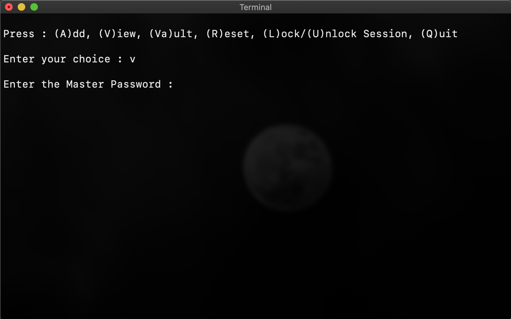
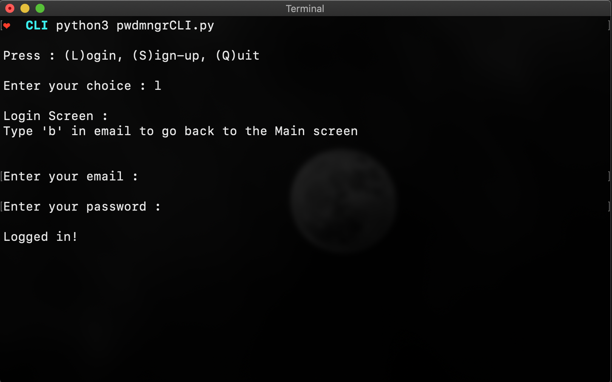
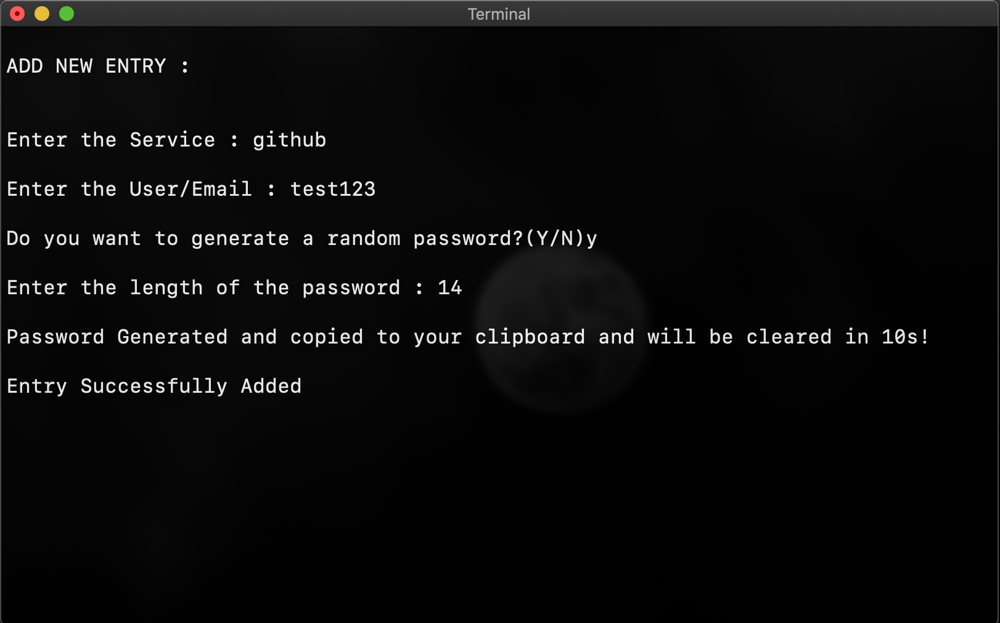
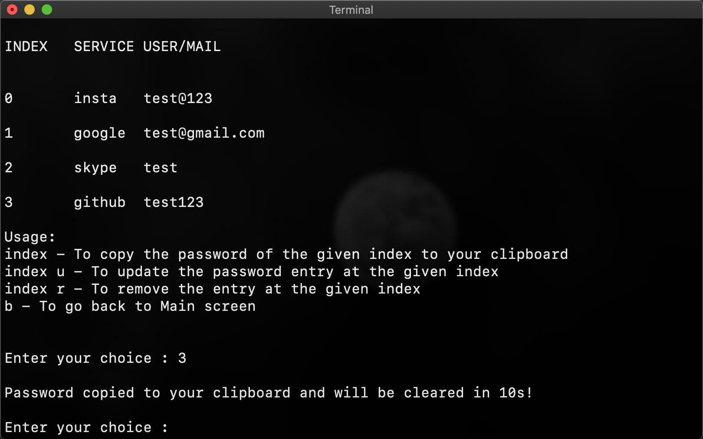
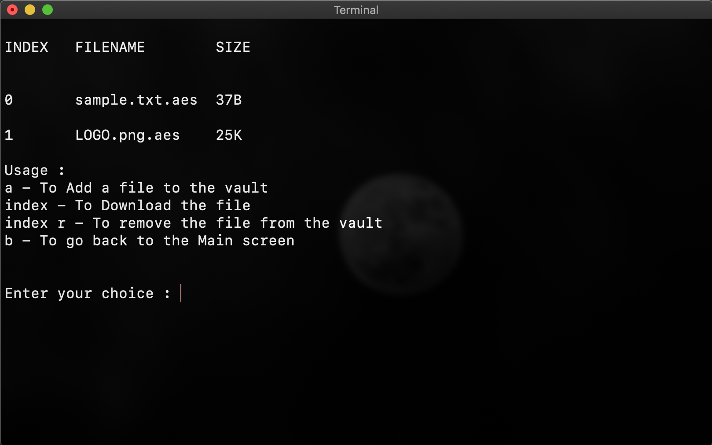

# PasswordManager-CLI
Command Line version of my amazing [Password Manager](https://github.com/Maneesh-Pradeep/PasswordManager).

[](https://www.buymeacoffee.com/maneeshpradeep)

## Overview
A fully functional and secure Password Manager and file storage vault with cloud support accessible via your command line/terminal.



## Main features
It contains all the features and functionalities of the GUI version of my [Password Manager](https://github.com/Maneesh-Pradeep/PasswordManager). So it is adviced you take a look at that repository to know more about the functionalities.

But incase you are lazy like me and wants all info on a single place. Don't worry, I got you covered.

Here are the some of the key features :
### 1. It stores all your passwords in the **cloud**
  I have integrated this project with my Firebase Console developed by Google to store all the user's data
### 2. All your passwords stored in the cloud are encrypted
  All your passwords in the cloud are stored as encrypted text and not plain text and the key is generated using User Identity based key generation algorithm, so only you can view your data. Not even the admin of the cloud server (me) can view your passwords.
### 3. Secure File Encryption Vault
  I have added a new File encryption Vault, where users can store their important documents safe in the cloud. THe files will be encrypted using AES encryption algorithm before storing in the cloud, so users don't have to worry about the security of their documents.
### 4. Amazing and Secure Command Line Experience
  The program is designed in such a manner that, it doesn't reveal any of the users' sensitive information on the output screen, not even the user's mail address. Only the emails of the associated service will be output on the screen without which the user can't identify the exact password they are looking for, as a user can have multiple accounts for a single service. 
### 5. Secure User authentication
  The user is authenticated using an email and password powered by the Firebase console developed by google, so users can rely on the fact that their account is stored in a secure place.
### 6. In-built Password Generator
  I have also added an in-built Password Generator to generate strong and secure passwords. The user has the freedom to choose the output Password length.
### 7. Email verification and Reset Password
  The users can reset/change their password after logging in. A link will be sent to the respective mail where the user can change their password.
  
  **Note:** Users cannot access their account if they forget their account password, as all their passwords and files are encrypted using their master password. I cannot help you if you forget your master password.
### 8. Clipboard access
  The passwords will not be displayed on the screen, rather will be copied to the user's clipboard and will be automatically cleared after 10 seconds.
### 9. Session Lock
  The user can Lock or Unlock their session after logging in, by doing so, the user need to provide the master password everytime they want to view their saved passwords or file vault. This feature makes sure that no one can view your information even if you're not near your computer during an active session. The session is locked by default.

## Installation
```
# Clone this repository
git clone https://github.com/Maneesh-Pradeep/PasswordManager-CLI.git

# Change directory
cd PasswordManager-CLI

# Install the requirements
pip3 install -r requirements.txt

# Execute the python file
python3 pwdmngrCLI.py
```

## Screenshots











